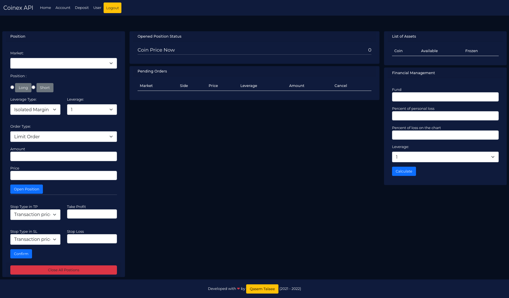
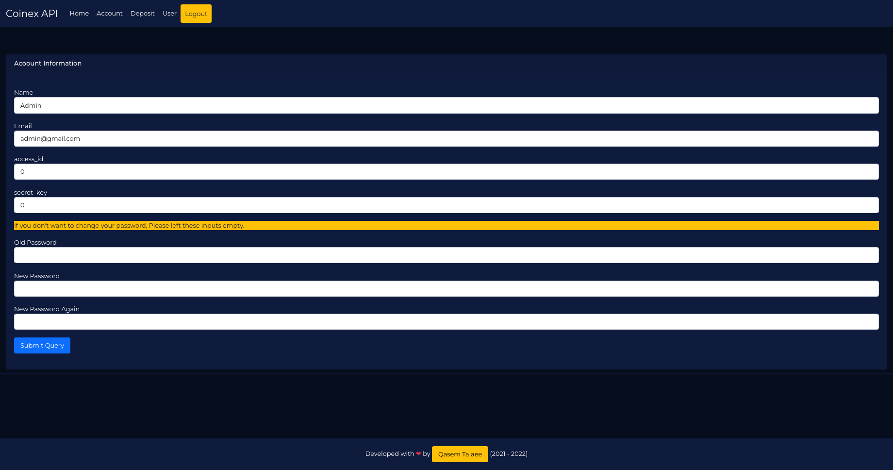
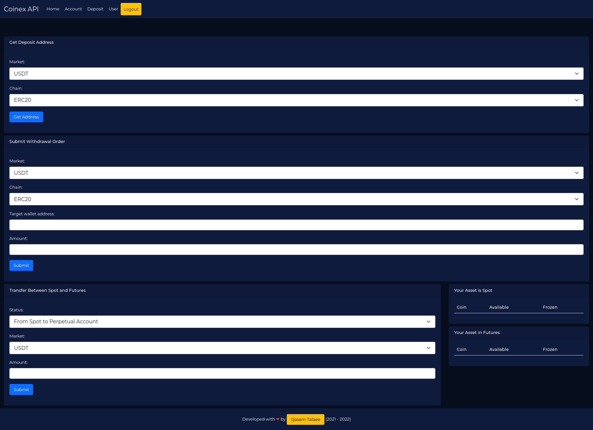
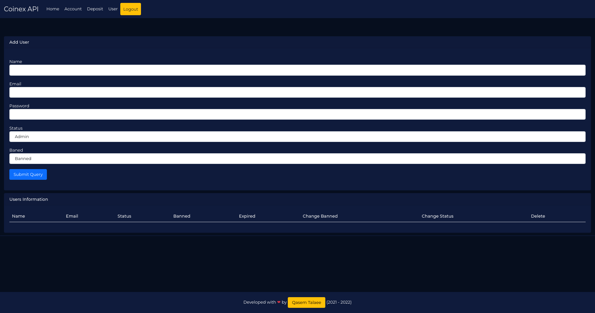

# A Bridge for Coinex
With this system you can trade in coinex future with static ip.System has written by flask and API.You can run it in server with static ip.

System is multiuser.You are admin and you can add users.Database is sqlite3.

You and other users must do two work to you can use it.
1. You must introduce the server ip to your coinex account.
2. You must enter your coinex access_id and  secret_key  to the system.

Admin information to login is :
```
Email : admin@gmail.com
Password: admin
```

## Installation
```bash
sudo apt install python-venv python3-pip
```
```bash
python3 -m venv ./venv
```
```bash
source ./venv/bin/active
```
```bash
pip install -r req.txt
```
```bash
python3 main.py
```

## See Some Screenshots



